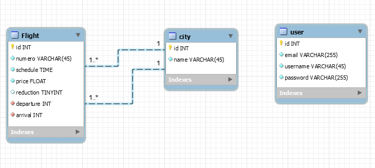

# Analyse générale du projet

Une compagnie de vols privés propose des trajets VIP vers des capitales européenes.
Une application avec :
    - un système de login avec deux types de user( USER, ADMIN )
    - un espace privé qui affiche les vols et propose des actions pour :
        >créer un nouveau vol
        >modifier un vol
        >voir un vol
        >supprimer un vol

L'application à ce stade permet de gérer les vols de la journée en cours.

## Analyse fonctionnelle
- A faire par les élèves.
- Compréhensible par le client
- Peut donner lieu à un Use case UML

# Couche métier
- Dégager les types de données
- Ici : 
    1. Vol || Trajet
    2. Capitale
    3. User

## Modélisation BdD
- Un diagramme de classe UML basé sur l'analyse fonctionnelle.
- Nous ici, on va créer un diagramme MySQLWorkbench.
    

# Configuration de l'application
1. Database
2. Les entités Flight et City, et leur relation (ne pas faire User)
3. Les fixtures
    - Créer un tableau d'objet de type City
    - Créer un ou deux vols
        > numero de vol statique : ex : AH2349
__NB__ : Eviter le copier/coller de code.

# Modification

# Entité Flight

On va ajouter un attribut `seat` (integer, nombre de sièges restants)
Nouvelle migration
Modifictaion des fixtures

- On ajoute l'alimentation via un setter : setSeat()
- On va créer plusieurs nouveaux vols (travail de boucle)
    (pour le moment les numéros de vols et les horaires restent les mêmes, dans les fixtures)

# Automatisation 
L'application est générée automatiquement (du moins le coeur) avec :
```bash
symfony console make:crud
```

## Personnaliser
Ajouter bootstrap pour les pages, le thème de formulaire
Ajouter votre style au besoin

## Gérer la classe FlightType
- tous les champs ne sont pas requis (?)
- la relation avec City
- Ajouter les contraintes

# Créer une classe de service
## Création
- On crée une classe dans le namespace App\Services\FlightServices
- Ce service va permmettre d'attribuer un numéro de vol aléatoire composé de 2 lettres et 4 chiffres lors de la création d'un vol.
## Utilisation dans les fixtures
__NB__ : 
  - On ne peut pas injecter directement dans la méthode load()
  - Il faut passer par un __construct(). On injecte le service
  - On crée pour cela un attribut private
  - Puis dans la méthode load()
```bash
$flight
    ->setNumero($this->flightService->getFlightNumber())
```

# La sécurité

# Entité User
```bash
symfony console make:user
# en retour
 created: src/Entity/User.php
 created: src/Repository/UserRepository.php
 updated: src/Entity/User.php
 updated: config/packages/security.yaml
```


